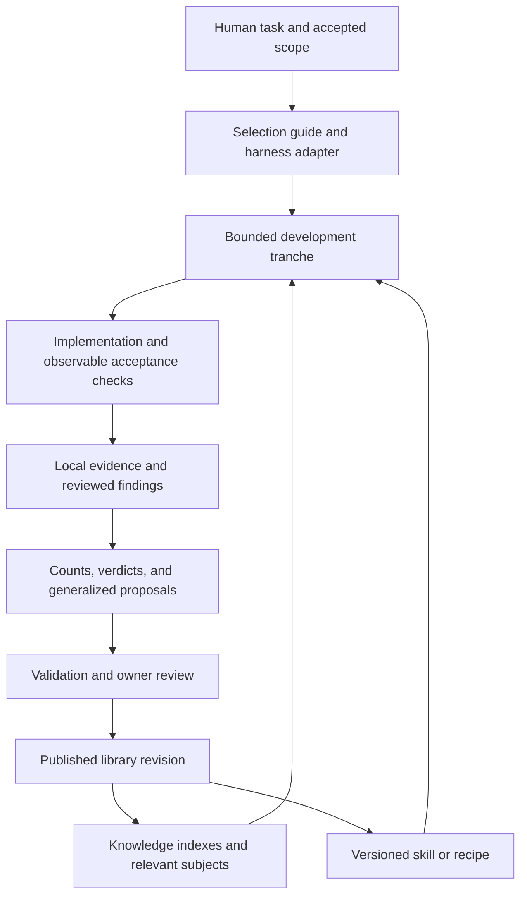

# Architecture review and upgrade tranches

Date: 2026-09-09. Baseline: `159b40b059fc68d8c08a44960d80b88de615df13`.

## Verdict

Keep the lane architecture. It provides a useful separation between reusable knowledge,
procedures, installation configuration, and contributed evidence. Stable subject identities,
generated indexes, explicit versions, and local evidence overlays are good foundations.
Reorganizing everything into a new directory hierarchy would spend migration effort without
addressing the principal weaknesses.

The next investment should make the library easier to select from, safer to evolve, and
better at demonstrating results. Its content and written governance have grown faster than
the mechanisms that enforce them. Several promises in its documentation do not match its
execution paths. This is a capable knowledge repository whose assurance and multi-harness
distribution remain incomplete.

The important distinction is **well structured**, **factually verified**, and **shown to
improve development outcomes**. The current machinery establishes much of the first. It
provides useful but incomplete evidence for the other two.

## Scope and method

The [coverage ledger](2026-09-09-coverage.md) records every knowledge category, recipe topic,
and all 458 knowledge subjects. The initial tracked-file inventory contains 6,684 entries,
56,671,626 bytes, 31 shared skills, nine knowledge bundles, and 133 recipes.

This pass inventoried all tracked regular files, ran corpus-wide structural and maintenance
instruments, inspected governing specifications and CI wiring, and read selected architecture,
agent workflow, memory, and evaluation material. It is an architectural review of the whole
repository, not a claim that every sentence or external citation has been independently
verified. Subject-level semantic verification remains explicitly pending in the ledger.

Initial structural validation covered 5,252 concept documents and 12,866 links. All 3,120
techniques had `use_when` metadata. Those are measured properties, not scores for prose quality.

Other work was active during the review. Three untracked recipes and edits to
`change-implementation-and-review` arrived after the initial inventory. The regenerated recipe
index includes that working-tree content, bringing the checked lane to 136 recipes. Their
authorship and semantic validation belong to the other session. Existing `.claude/worktrees/`
and `.personas/memory-outbox.jsonl` were preserved. Local scratch and benchmark files were
excluded from the tracked-file baseline.

## Confirmed findings

Priority 1 affects enforcement, execution boundaries, or a core format contract. Priority 2
affects reliability, maintenance, or usability. Priorities are judgments, not measured scores.

| ID | Priority | Evidence and consequence | Disposition |
| --- | --- | --- | --- |
| R01 | 1 | `registry.yaml`, `recipes/README.md`, and `check-recipes.mjs` describe CI enforcement, but the baseline contained only `knowledge.yml` and `skills.yml`; neither invokes recipe validation. Recipe-only changes could avoid both shape and version checks. | Added `recipes.yml` with shape/index and PR version checks. Remote required-check configuration was not inspected. |
| R02 | 1 | `knowledge.yml` omitted `rules/**` from its trigger filter while validating generated rules inside the workflow. A rule-only edit could avoid the freshness check. Governing docs and declarations also did not consistently trigger checks. | Widened knowledge triggers to include rules, docs, and declarations. A full dependency-to-workflow parity check remains proposed. |
| R03 | 1 | The README and CONTRIBUTING said installation updates are explicit; `registry.yaml` declares live links as default. The shared reflection clause assumes every installation is a writable link and prescribes edits in the registry. Linked consumers see uncommitted changes; cached/copied installations have different behavior. | Corrected entry-point documentation. Separate development and release installation modes in tranche 3. Do not silently change existing links. |
| R04 | 1 | `projects.json` commits an absolute machine root, while CONTRIBUTING forbids machine paths and the header of `scripts/lib/projects.mjs` describes the file as containing no absolute paths. | Contract conflict recorded. Decide whether this repository is a public library with private fleet overlays or a fleet-specific registry, then migrate deliberately. No fleet configuration was changed. |
| R05 | 1 | `check-recipes.mjs` compares five `RECIPE.md` frontmatter fields but never compares the rendered body against JSON. Contradictory activities or guidance can pass. | Documented the limit in the format specification. Add a deterministic renderer and full-body freshness checks in tranche 2. |
| R06 | 2 | Recipe docs advise subdivision above ten children. The validator and index builder accept exactly `domain/topic/slug`; a fourth grouping level is rejected. The baseline already has ten domains and ten software-engineering topics. | Preserve paths now. Choose an explicit fixed-depth limit or introduce variable depth with consumer compatibility fixtures in tranche 2. |
| R07 | 2 | `gate --lane recipes --write` checked index freshness before the index generator could run. Also, a blocked child process was reported as a stale index because every nonzero/null status was treated as a content defect. | Added shape-only validation for regeneration and explicit subprocess failure classification, with regression tests. |
| R08 | 2 | Initial freshness checks found `cx` at 1.2.0 while the marketplace advertised 1.1.0, plus a stale media-generation rule. The recipe index became stale while concurrent recipe work arrived. | Regenerated these views and ran the full validation chain. |
| R09 | 2 | Root navigation carried stale counts and versions; recipes were absent from the contributor gate table. Knowledge README regeneration instructions omitted the bundle index and rules. No root `AGENTS.md` existed. | Added agent entry guidance and workflow selection, removed the hand-maintained skill version table, and corrected contributor instructions. |
| R10 | 2 | Knowledge currency reports 277 applications without a clock, 502 runtime-bearing applications without a version witness, and 64 detected major-version drifts among 873 witnessed applications. Four bundles have no reporting installation. | Reverify by risk and actual use; do not backfill verification metadata from a manifest. |
| R11 | 2 | The baseline recipe gate reports 133 `seed` recipes and zero lesson entries. Impact protocols already exist in assay and harvest, but that is not evidence every recipe has passed them. | Reuse those protocols; connect outcomes to promotion criteria and report unknowns explicitly. |
| R12 | 2 | Signals contain references to subjects in the wrong bundle and duplicated contributor blocks; usage reports seven unpublished skill names. Validators allow these and warn. | Add observable unresolved-reference handling and stable identity migration; do not infer zero demand from dropped rows. |
| R13 | 2 | Several skill entry files are large: research 1,405 lines / 15,663 words; architect 1,150 / 10,751; explorer 835 / 7,863; scan-sweep 772 / 7,908. These are input-size measurements, not proof of poor behavior. | Extract optional reference sections behind explicit loading conditions and compare behavior before/after in tranche 4. |
| R14 | 2 | `gate.mjs` explicitly admits that its local list can drift from CI; practices and memory are covered by catalog freshness, not dedicated shape gates. The exit-code scan checks literal exits at two directory levels, not every possible runtime exit. | Add lane contract fixtures and validation-plan parity. Keep limitations visible. |

The sandbox initially blocked Git and nested Node processes with EPERM. Checks were rerun
with approved subprocess access. That environment issue exposed R07, but it is distinct from
the real stale artifacts and from recipe edits arriving during the run.

## Folder-by-folder assessment

Counts below are the initial tracked-file snapshot. The coverage ledger expands the domain
and topic groups; this table assesses their architectural role.

| Folder / surface | Baseline | Assessment and superior path |
| --- | ---: | --- |
| Root declarations, README, CONTRIBUTING, CODEOWNERS | 9 files | Preserve `registry.yaml` as the neutral contract. Separate portable library policy from operator fleet declarations. CODEOWNERS expresses ownership; enforcement also depends on host settings. Entry documentation should route to authoritative indexes instead of duplicating versions. |
| `.ascent/` | 1 | Appropriate consumer overlay. Reconcile `catalogWrites: bot` with the narrative that content enters through PRs, distinguishing telemetry fields from authored content. Test unknown-field preservation in the consumer rather than assuming it. |
| `.personas/` | 1 | A second consumer overlay is the right extension point. Its comment says the knowledge reader walks the tree, which contradicts the blanket claim that all consumers use indexes. Verify this consumer before any taxonomy migration. Keep the untracked memory outbox local. |
| `.claude/` | 22 | Maintenance methods are correctly separated from published skills. Their format, tool assumptions, private overlays, and evaluation dependencies need an explicit maintenance contract and adapter coverage. Do not treat cached source notes or scorecards as current instructions automatically. |
| `.claude-plugin/` | 1 | Generated distribution view is appropriate; R08 showed it can be stale in a checkout. Keep generation deterministic and qualify installation/update semantics by harness and mode. |
| `.github/` | 2 | Baseline wiring missed recipes and rule-only changes. First repairs add coverage; next add one auditable validation plan and tests of failure cases. Scheduled external checks should remain separate from deterministic merge checks. |
| `docs/` | 44 | Strong specifications, but proposals and active contracts share the navigation surface. Add status, owner, supersession, and implementation-gap links to proposals; avoid converting historical plans into silent policy. |
| `knowledge/` | 5,294 | Preserve the four-layer model and stable slug identity. Review semantic applicability and evidence quality before further broad expansion. Cross-bundle duplication deserves explicit ownership or typed references, with compatibility tests before changing the current prohibition. |
| `skills/` | 90 | Useful coverage of the development lifecycle, with versions and shared clauses. Add selection boundaries, explicit required capabilities, and installation-mode-aware reflection. Evaluate large-body reductions rather than enforcing arbitrary word caps. |
| `recipes/` | 540 | JSON authority plus readable prose is sound only if both agree. First add full rendering parity and settle depth semantics. Keep recipes as reusable work methods and charters as bound installations. Seed status is honest and should remain until evidence supports promotion. |
| `practices/` | 21 | Reusable starters are valuable. Add checks for frontmatter, IDs, referenced starters, and the distinction between a template and adopted policy. Review overly absolute claims: the test-tier practice asserts order-of-magnitude cost differences without a measurement. |
| `memory/` | 7 | Kind and confidence metadata help, but examples and empirical fleet notes coexist. Mark their scope and provenance clearly. Dated model comparisons should remain observations about the tested tasks and harness, with re-evaluation conditions rather than permanent routing law. |
| `rules/` | 10 | Generated, domain-selected context is a good bridge to use. Keep the entry rules small and measure actual loaded context. The compression scan's inferred always-on category includes laws; it is not a trace of what this harness actually loaded. |
| `scripts/` and `scripts/lib/` | 50 total, including experiments | The dependency-free core and shared taxonomy/hash readers are strengths. Separate pure parsing/derivation from CLI execution, classify failure results consistently, and test malformed inputs and missing dependencies. Avoid applying operator scripts across the fleet as part of a library-only review. |
| `scripts/experiments/` | Included above | Useful existing impact experimentation. Document task/model/input pins, worktree isolation, failure handling, and cost ceilings; distinguish an experimental runner from a supported registry command. |
| `usage/` | 1 | Counts-only publishing is useful. Add alias/retirement handling for unknown skill names and a visible freshness denominator. Invocation counts alone do not establish successful outcomes. |
| `signals/` | 2 | Verdicts without private evidence pointers are a strong boundary. Improve identity resolution and contributor independence semantics. Preserve the existing floor/ceiling treatment of duplicate state reports. |
| `librarian/` | 589 | Keep the existing coverage, source, handoff, harvest, and run ledgers. Reconcile stale narrative with machine readings; for example `index.md` lists eight bundles while nine exist. Give leads explicit return/retirement conditions and link completed work to acceptance evidence. |
| `.bench/`, `.explorer/`, `.perfect/`, `.worktrees/`, local JSON files | Excluded | Working evidence and machine state, not library content. Preserve isolation and avoid accidentally indexing other sessions' checkouts. No content-quality verdict was assigned to these local directories. |

## Topic-by-topic priorities

### Software engineering

All ten categories should remain in this domain. Their shared laws and cross-references are
a stronger organizing principle than an arbitrary split by size.

| Category | Files | Review focus and proposed upgrade |
| --- | ---: | --- |
| `llm-agent` | 630 | Start here: orchestration, prompt/context assembly, memory, tools, approvals, evaluation, runtime/IO. Add capability and authority boundaries to procedure selection. Test interrupted runs, missing tools, stale memory, and bounded recovery. |
| `engineering-process` | 379 | Align knowledge-registry, quality-gates, concurrent-vcs, codegen, and docs-sync guidance with this repository's real behavior. Use one tranche handoff shape and executable failure cases. |
| `engineering-assessment` | 159 | Separate conformance, activity, quality, and value. Freeze acceptance measures before implementing; record denominators and counterexamples. Avoid scoring a library by the volume of generated guidance. |
| `backend-platform` | 712 | Prioritize state transitions, idempotency, queues, transactions, lifecycle, and recovery. Recheck version-sensitive applications; demand a concrete failure scenario for proposed universal rules. |
| `operations` | 245 | Audit release, observability, incident, and rollback contracts as complete sequences. Distinguish simulated incident handling from an exercised recovery. |
| `security` | 160 | Trace authority across agent tools, untrusted sources, permissions, extensions, and credential boundaries. Apply the same separation to library maintenance and consumer execution. |
| `secret-custody-and-issuance` | 40 | Retain its relationship to security; make threat assumptions and host requirements explicit. Require relevant source/version evidence before expanding implementation prescriptions. |
| `integration` | 128 | Validate boundary schemas, pagination, retries, rate limits, and partial failure. Pair recipes with provider-specific examples without moving connector bindings into portable methods. |
| `client-architecture` | 118 | Examine state/cache ownership, synchronization, invalidation, and teardown. Add small counterexample scenarios for interacting rules. |
| `ui-surfaces` | 359 | Tie accessibility, UX, and interaction claims to observable tasks. Keep UAT, visual inspection, and code checks as distinct evidence. Prioritize the reported accessibility deviations. |

### Other knowledge domains

These reviews concern composition and validation strategy. This pass does not certify legal,
financial, hiring, or domain-specific correctness.

| Domain | Subjects / techniques / applications | Next semantic pass |
| --- | --- | --- |
| Civic intelligence | 15 / 92 / 35 | Cover accountability, civic graph, parliamentary data, and public money. Verify provenance and claim attribution; distinguish data completeness from conclusions. No reporting installation establishes live use. |
| Game production | 52 / 328 / 139 | Cover systems canon, balance, content, assets, engine integration, craft judgment, and governance. Link generated-asset acceptance to runtime integration checks and playable outcomes. |
| Grant funding | 17 / 105 / 38 | Cover landscape, matching, proposals, and operations. Reverify dated program requirements against actual sources. All 28 runtime-bearing applications lack version witnesses in the baseline report. |
| LLM observability | 17 / 115 / 63 | Cover telemetry/data, economics/governance, scoring, and federation/surfaces. Reconcile subject identities with software engineering; validate collector independence before treating counts as demand. |
| Localization | 15 / 91 / 45 | Cover craft and each script/language grouping. All 45 applications lack a clock in the current instrument; distinguish intentionally stable language references from mutable tooling. Existing librarian coverage is useful but is not fresh external verification. |
| Marketing | 30 / 181 / 80 | Cover search, content, paid advertising, measurement, local visibility, conversion, and positioning. Test measurement claims and separate conventions from observed results. No reporting installation establishes transfer. |
| Media generation | 20 / 136 / 66 | Cover narrative, grounding, visual/audio generation, and production operations. Verify provider-specific methods at the application layer, preserve asset lineage, and use outcome tests rather than aesthetic prose alone. |
| Recruiting | 64 / 384 / 194 | Cover role definition, sourcing, evidence, assessment, decisions, pipeline, candidate experience, governance, and measurement. Prioritize claim limits and the 107 drift-blind runtime applications. No blanket compliance conclusion follows from these documents. |

### Recipes and shared procedures

The coverage ledger enumerates all 46 recipe topics at baseline. Use the following order,
which prioritizes the user's automated-development purpose without deleting the broader library.

| Recipe domain | Baseline recipes | Focus |
| --- | ---: | --- |
| `software_engineering` | 42 | All ten topics: code review, codebase health, cost safety, engineering records, error triage, event routing, incidents, observability, release, and work intake. Validate that required inputs can be obtained and outputs satisfy a falsifiable acceptance condition. |
| `data_ai` | 8 | Agent context, data access, and data quality. Check authority, provenance, and the distinction between observed data and inferred conclusions. |
| `product_project` | 5 | Feedback, delivery, and ideation. Connect proposals to bounded development tranches and observed outcomes. |
| `general_professional` | 13 | Correspondence, decisions, digests, reviews, and curation. Keep communication authorization and local knowledge separate from reusable procedure content. |
| `creative_design` | 13 | Audio, newsletters, social publishing, video, and visuals. Connect generation to acceptance and publication prerequisites. |
| `sales_marketing` | 19 | Community, conversion, leads, and analytics. Check source availability and causal claims before automating decisions. |
| `customer_support` | 8 | Retention, service health, SLA, and tickets. Test escalation and partial-information scenarios. |
| `finance_accounting` | 12 | Audit, investing, revenue, and budgets. Keep calculation evidence and decision authority explicit; domain review is still required. |
| `legal_compliance` | 9 | Monitoring, contracts, deadlines, and litigation. Treat jurisdiction, dates, and source requirements as applicability constraints to verify. |
| `operations_logistics` | 4 | Approvals, intake, inventory, and network planning. Verify that proposed actions have available inputs and authorized execution paths. |

All 31 shared skills are routed in the [selection guide](../skill-selection.md). Start their
behavioral review with the coordinating workflows: architect, scan-sweep, explorer, perfect,
ship-loop, and spark. Then examine their shared dependencies: consult/conform, test-before-commit,
and reflection. Selection ambiguity is a hypothesis to test; the existing lexical trigger scan
found no near-collisions at its configured threshold of 0.45.

## Proposed target composition

The content lanes remain. Add thin adapters and stronger contracts around them. Live
development links and explicitly updated releases should be named installation modes with
different semantics. A consumer should be able to report exactly which library revision,
skill version, and capabilities produced a result.

## Upgrade tranches and exit criteria

Each tranche should produce a focused diff, a recorded baseline, acceptance evidence, and a
rollback. The table is an implementation plan, not a claim these later tranches have run.

| Tranche | Scope and dependency | Deliverable | Completion evidence |
| --- | --- | --- | --- |
| 1. Restore enforcement and navigation | This review; no corpus moves | Recipe CI; widened triggers; accurate subprocess errors; workable recipe regeneration; fresh views; agent entry point; workflow guide | Full local gate passes; error-classification regression tests pass; generated diffs inspected. Implemented locally. |
| 2. Make format contracts executable | After tranche 1 | Recipe renderer with `--check`; explicit depth policy; practice/memory validators; fixture suite; shared validation-plan or CI parity mechanism | A prose-only recipe mismatch fails; malformed and unknown-field fixtures have declared outcomes; stale views regenerate; all lane inputs have a check path. Existing consumers pass compatibility fixtures before depth changes. |
| 3. Separate installation and authority | Can be designed alongside tranche 2 | Development/release modes; Codex adapter; required-capability declarations; reflection rules that respect the actual installation; resolved fleet privacy contract | A pinned consumer remains unchanged during a development edit; update/rollback is explicit; Codex discovers a selected skill and completes a smoke task; missing tools produce an honest result. No silent relinking of existing projects. |
| 4. Improve selection and context use | Requires tranche 3's capability model | Split optional material from large skill entry files; document coordinator boundaries; add task-to-skill routing cases | Frozen positive and negative routing tasks; compare old/new procedures with identical inputs; no lost acceptance behavior; measure actual loaded bytes/tokens and time. No quality claim from line count alone. |
| 5. Verify agentic-development topics | Uses tranche 2 contracts and existing librarian ledgers | Subject-by-subject review of LLM/agent, engineering process, assessment, then remaining software-engineering categories | Every subject row has a dated decision at a revision, source checks where required, a counterexample review, and accepted changes or a reason to retain it. Runtime witnesses come from actual verification. |
| 6. Verify remaining domains and recipes | After review method is exercised in tranche 5 | Drain all remaining subject rows and recipe topics; evaluate priority recipes through existing assay/harvest methods | No unassigned subject/topic; maturity changes cite field evidence; failures and unknowns remain visible; all changed artifacts pass gates and version discipline. |
| 7. Close the learning loop | Incremental after tranche 2 | Stable telemetry identities; unresolved-reference reporting; explicit freshness; repeatable impact records | No silently discarded migration aliases; duplicate state reports cannot inflate priority; outcomes tie back to a task, artifact version, and baseline; negative results create review work. |

A practical semantic review unit is one subject and its owned techniques/applications, or one
recipe and its examples. Group adjacent units into a tranche only when they share a decision.
Before changing a rule, record: its trigger, claimed benefit, failure if ignored, conditions
where it should not apply, source strength, and a way to observe the claimed improvement.

Use `keep`, `clarify`, `split`, `merge`, `deprecate`, or `reverify` as review dispositions.
Do not require every review to add content. Retirement and a well-supported decision to keep
something unchanged are valid upgrades to the library's assurance.

If parallel reviewers are used in a future pass, assign disjoint subjects or recipe folders
and keep shared specs, generators, indexes, and integration with one coordinator. Freeze the
baseline and acceptance rubric before dispatch; have integration review cross-folder findings.
This review did not run a multi-agent evaluation or spend provider API budget.

## Validation and limits

- `node scripts/gate.mjs --all`: 15/15 checks passed after first-tranche repairs.
- `node scripts/tests/check-result.test.mjs`: three tests passed, including blocked,
  interrupted, incomplete, successful, and violation-reporting subprocess outcomes.
- An isolated temporary recipe fixture verified that stale index checks fail, `--write`
  repairs the index, the subsequent check passes, and malformed source blocks regeneration
  without changing the existing index. No live recipe was altered for this test.
- Local destinations in the edited and new guidance were checked: 710 links resolved.
- Bundle integrity: 5,252 concept documents, 12,866 links, 5,294 files at the baseline.
- Recipe index and shape: 136 recipes in the concurrent working tree after regeneration.
- Maintenance and currency reports ran; their unresolved references, drift, unknowns, and
  duplicate-state warnings remain findings rather than being relabeled as resolved.
- Skill trigger scan found no near-collisions under its lexical heuristic. This is not a
  behavioral routing evaluation.
- CI definitions were edited and inspected locally. Hosted workflow execution and branch
  protection settings were not verified. PR history-based version checks are separate from
  the full local chain and were not claimed as a test of the concurrent recipe edits.
- External citation liveness, every domain claim, consumer behavior, and paid model A/B
  evaluations were not verified in this architectural pass.

Codex adapter recommendations were checked against official documentation on 2026-09-09:
[project instruction discovery](https://learn.chatgpt.com/docs/agent-configuration/agents-md)
and [skill discovery and progressive disclosure](https://learn.chatgpt.com/docs/build-skills).
Other findings cite local contracts, implementation paths, or measured command output above.
