# The Token Tax

*One refund message, six languages, and a meter calibrated in English. Why the same sentence costs more, fits less and sometimes understands worse when it is not English, measured on the tokenizers in service in October 2026.*

> “Your refund has been approved. The money will reach your account within five business days.”

To the tokenizer behind the GPT-5 models, that sentence is 17 tokens. Translated into Hindi, it is 30. Fed to the open-weight Qwen3 tokenizer, the same Hindi sentence becomes 85 tokens, and 42 of them cannot be printed on their own, because each one holds part of a letter’s bytes. The model must glue those shards back into characters before it can start reading. [1]

Qwen3.5 brings the Hindi sentence down to 39. Gemma 4 does it in 23. Same meaning, same customer, and a token count that swings almost fourfold depending on which vocabulary reads it. English is 17 on every one of them.

This is the token tax. Engineers meet it as an invoice line that grows faster than traffic in one region. Localization teams meet it as a quality gap nobody can explain, in a language the product officially supports. It is one problem seen from two desks, and this post carries the refund message past both: into the place where text gets cut, onto the bill, into the context window and the cache, and finally to the question of whether a model that reads more pieces understands less. The answer to that last question is messier than the usual headline. The mess is the useful part.

**In this post** · 14 min read · 8 figures · 4 tables · 23 sources

1. **A vocabulary is a census**: how merges, corpus mix and byte fallback set the price
2. **Six bills for one sentence**: the running example on current tokenizers
3. **Twelve languages, six vocabularies**: where the gap closed, and where it did not
4. **Where the tax is collected**: bill, window, clock, output cap
5. **The estimator speaks English** and **the cache sees bytes**: two production traps
6. **More tokens, less understanding?**: the evidence on both sides
7. **Who sets the rate** and **what the refund message showed**

After reading, you will be able to:

- measure the premium your own locales pay on the model you actually call, and key budgets to it;
- lay out prompts so that thin locales stop paying the uncached price;
- tell a tokenizer problem from a training-data problem before choosing a fix.

## A vocabulary is a census

A tokenizer turns text into integers from a fixed vocabulary, and those integers are all the model ever sees. The common kind, **byte-pair encoding** (BPE), starts from the 256 possible byte values and learns *merges*: across a training corpus it finds the most frequent adjacent pair, fuses it into a new vocabulary entry, and repeats until the vocabulary is full. Each merge is a bet that a chunk will be common. The corpus decides which bets get placed, so a finished vocabulary is a census of who wrote that corpus.

The writing system decides how much is at stake when a bet is missing. UTF-8 stores a basic Latin letter in one byte and every character in the block holding Devanagari, Thai, Tamil, Japanese and Ethiopic in three. [2] A byte-level tokenizer never fails (it “works on arbitrary text”, as the tiktoken README puts it), but text it has no merges for is billed at close to byte rate. [3] SentencePiece tokenizers such as Gemma’s reach the same safety net through “byte-level encodings” for characters outside the vocabulary. [4]

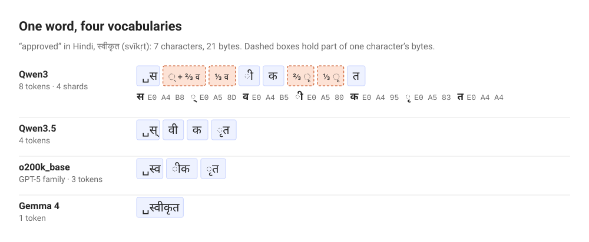

*Figure 1. How text becomes tokens. The English “approved” is one token in all four vocabularies. In Hindi, Qwen3 has no merge for two of the characters and falls back to raw bytes; Gemma 4 has learned the whole word. ␣ marks the leading space folded into a token. Sources: [1] (tiktoken 0.14.0, Hugging Face tokenizer files), byte values per [2].*

Two details in the vocabularies themselves explain most of what follows. First, a vocabulary has ancestors. Qwen’s technical report says its tokenizer took OpenAI’s `cl100k_base` “as our starting point” and added Chinese and other entries. [5] The inheritance is visible: the first two-character Devanagari entry sits at position 85,033 in Qwen3 and 86,133 in cl100k, deep in the list where only rare chunks live. Second, a bigger vocabulary is not automatically a fairer one. Qwen3.5 grew to 248,070 entries, yet its first two-character Devanagari entry sits at position 148,465, appended after everything inherited, and its Ethiopic entries fell from 116 to 25.

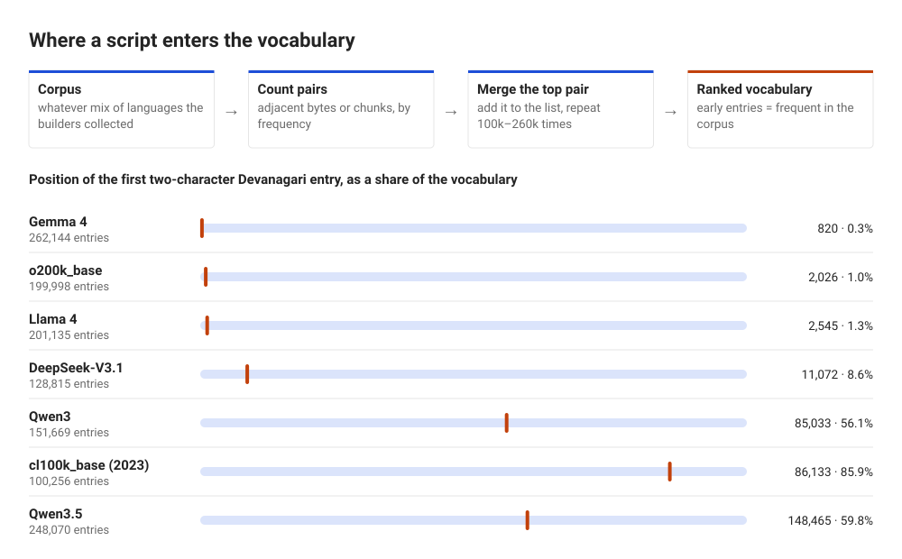

*Figure 2. The vocabulary records the corpus. Latin pairs enter almost immediately (position 258 to 261 in the byte-level vocabularies, right after the 256 single bytes). Devanagari enters at 0.3% of the way into Gemma 4’s list and at 86% of the way into cl100k’s. Position is the token’s index in the published vocabulary, which for BPE follows merge order. Sources: [1]; Qwen’s cl100k ancestry per [5].*

Count every entry by script and the census is explicit. Table 1 shows how many vocabulary entries each tokenizer spends on six scripts.

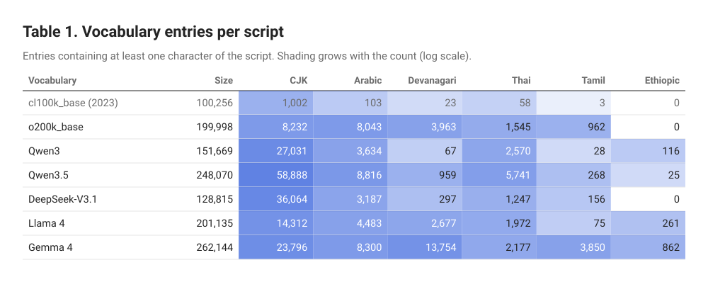

*Table 1. Gemma 4 spends 13,754 entries on Devanagari, more than three times o200k_base and 205 times Qwen3. Nothing in the 2023 vocabulary or in o200k_base covers Ethiopic, the script of Amharic, which is why Amharic keeps reappearing below. CJK counts Han plus kana. Source: [1], census over each published vocabulary.*

## Six bills for one sentence

Two terms first. **Fertility** is tokens per word; **premium** is tokens for a language divided by tokens for the same content in English. Fertility misleads across languages: a November 2025 paper reports Hindi fertility of 1.72 against 1.33 for English on the GPT-OSS tokenizer, which reads like a 30% gap, [6] yet a Hindi word is not an English word, and Japanese and Chinese do not separate words with spaces. Premium compares meanings, so this post uses it throughout. The translations below were made for this article in plain customer-service register; a professional translator would make different choices, and some would move the count.

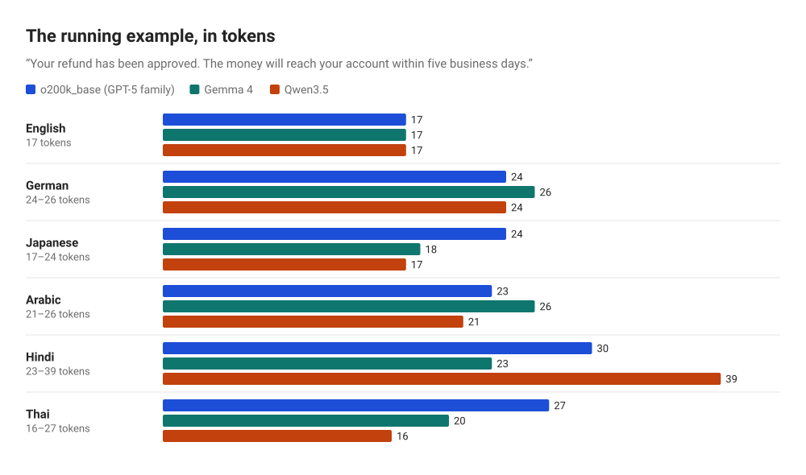

*Figure 3. The same sentence in six languages on three current vocabularies. English is 17 everywhere; no other language is stable. The cheapest tokenizer for Hindi (Gemma 4) is not the cheapest for Thai (Qwen3.5, where Thai beats English by one token). Source: [1].*

The cuts themselves are worth looking at. Here is the Hindi sentence on Qwen3, one box per token.

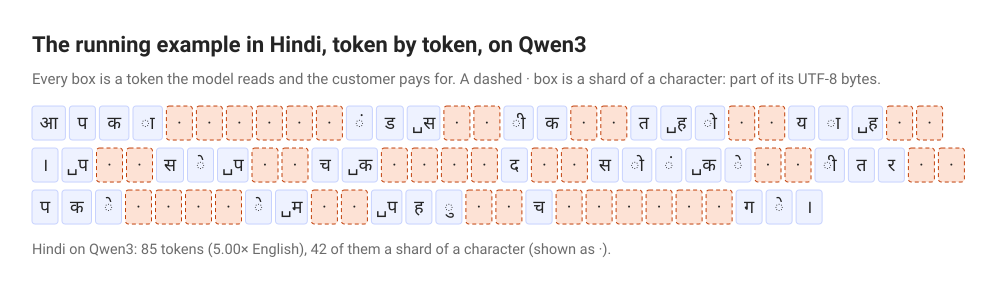

*Figure 4. The running example in Hindi on Qwen3, one box per token: 85 tokens, 42 of them a shard of a character. The web version of this post lets a reader switch between six languages and four vocabularies. Source: [1].*

## Twelve languages, six vocabularies

One sentence can flatter or punish a language by accident. Table 2 counts all 1,012 sentences of the FLORES-200 *devtest* split, Wikipedia-style English professionally translated into some two hundred languages, so every column carries the same meaning line for line. [7]

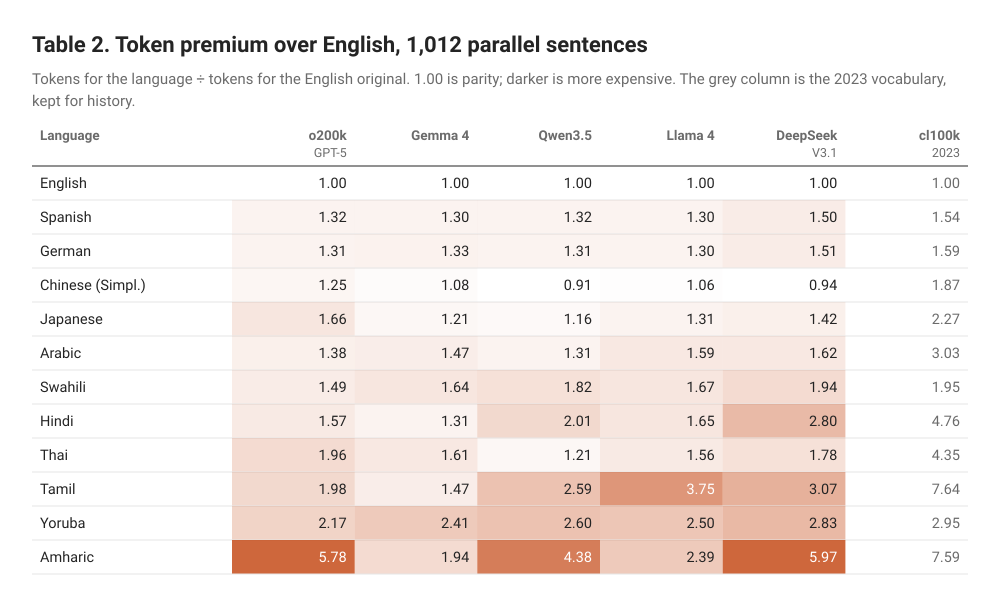

*Table 2. The gap closed for large languages and stayed open for small ones. On a related corpus, Somide (June 2026) reports Amharic at 7.36× on o200k_base against 5.78× here: the text set moves these numbers, so read any premium as a range. Sources: [1] on [7]; comparison figure from [8].*

Three readings. **The cut was real.** Between the 2023 vocabulary and o200k_base, Hindi fell from 4.76× to 1.57×, and Qwen’s own step from 3 to 3.5 took Thai from 2.55× to 1.21×. The 2023 papers that found gaps “up to 15 times” describe tokenizers that are mostly retired, and that is the strongest argument against the premise of this post. [9] [10]

**The cut was not shared.** Amharic still costs between 1.94× and 5.97× depending on the vocabulary, and it got slightly worse from Qwen3 to Qwen3.5 (4.05× to 4.38×). A June 2026 study of 20 African languages found a median premium of 1.88× on o200k_base, up to 8.92× for N’Ko, and concluded that “no tokenizer eliminates the penalty”. [8]

**Script is not the cause; the corpus is.** Yoruba and Swahili are written in the Latin alphabet, and Yoruba still pays 2.17× to 2.83× on every current vocabulary measured. Yoruba marks tone with diacritics on its vowels, and too little Yoruba was in the corpora for those marked syllables to earn merges.

> The tax is not levied by a language. It is levied by a pair: your language, and somebody else’s corpus.

The pair also changes under a fixed price. Anthropic’s pricing page states that its models from Claude Opus 4.7 onward use a newer tokenizer that “produces approximately 30% more tokens for the same text”, while the per-token price of Opus 4.7 matches its predecessor’s. [11] [12] Price per token is published. Tokens per sentence, in a given language, has to be measured.

## Where the tax is collected

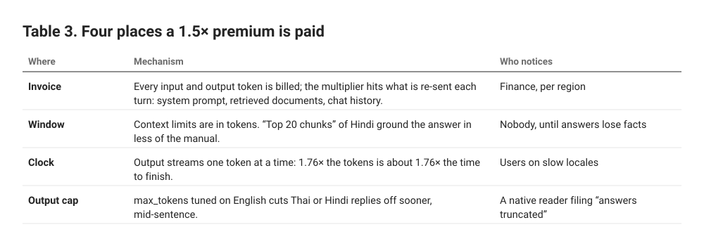

*Table 3. The bill is only the visible collection point. The 1.76× is the running example’s Hindi premium on o200k_base. Source: [1].*

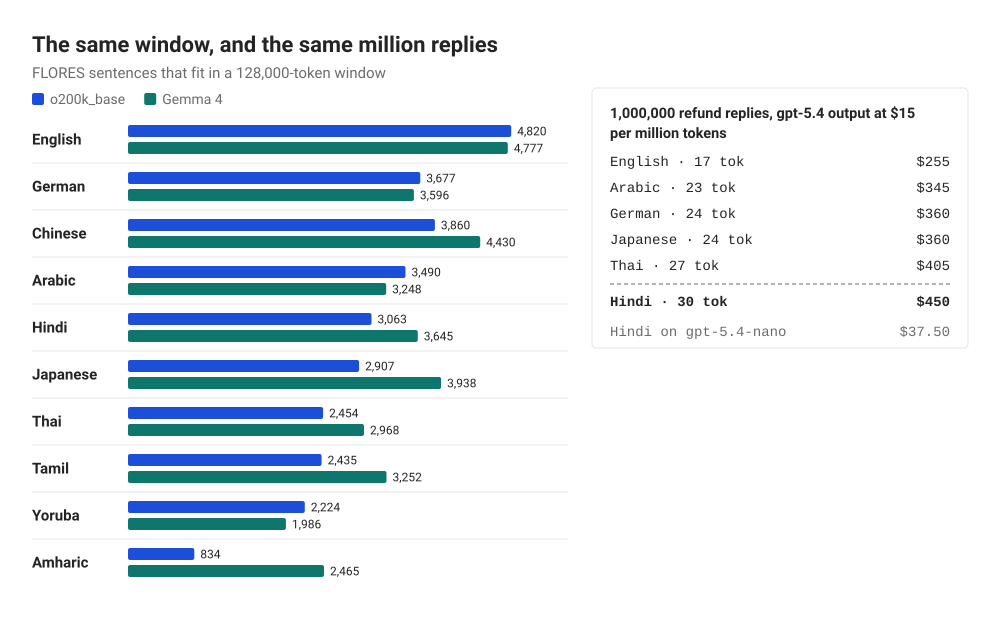

*Figure 5. Left: an Amharic reader gets about a sixth of the parallel text an English reader gets on o200k_base, and about half on Gemma 4. Right: output tokens only, priced from OpenAI’s page as read on Oct 5, 2026; tiktoken maps the gpt-5 model prefix to o200k_base. The last line is a limit on the thesis: choosing the smaller model moves the bill twelvefold, the language 1.76-fold. Sources: [1], [13], [3].*

Two of the three large vendors do not publish the tokenizer behind their current models. Gemini’s documentation counts tokens through a `countTokens` API call and offers a rule of thumb; Anthropic points to a token-counting endpoint. [14] [11] Gemma 4 is the nearest public proxy for Google: the Gemma 3 report says it uses “the same tokenizer as Gemini 2.0”, and Gemma 4 counted identically to Gemma 3 on all twelve languages here. [4] [1] Whether Gemini 3.x still uses it is not published. A team that wants a premium for its own model has to ask the meter, per locale.

## The estimator speaks English

Cost-aware systems check a budget *before* calling the model, and exact counts need the tokenizer, so plenty of code estimates. Google’s documentation says a Gemini token “is equivalent to about 4 characters”; Anthropic’s says one token is “approximately 4 characters or 0.75 words in English”; tiktoken’s README says “about 4 bytes”. [14] [11] [3] All three are fair for English. Figure 6 applies the two common rules to o200k_base counts on FLORES.

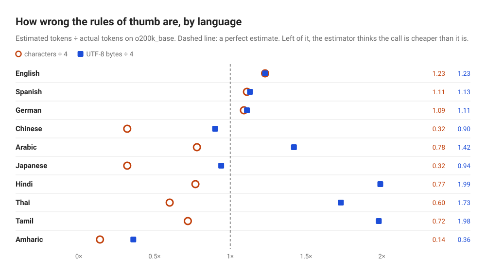

*Figure 6. The two heuristics fail in opposite directions. Characters ÷ 4 thinks Japanese and Chinese cost a third of what they do; bytes ÷ 4 thinks Hindi and Tamil cost twice what they do; both undercount Amharic. Google’s rule describes Gemini’s own tokenizer; the point is what happens when a rule like it is applied elsewhere. Sources: rules from [14], [3]; measurements [1].*

Underestimating is the dangerous direction: a budget gate that believes Japanese is three times cheaper waves through calls that overrun, and the dashboard reports the difference as unexplained spend in one region. The repair is a coefficient per model and locale, measured on real prompts rather than on encyclopedia prose, with the estimate logged beside the actual.

```python
# measure once per model, then budget with it
import tiktoken
enc = tiktoken.get_encoding("o200k_base")   # what gpt-5.x maps to

def premium(samples, base="en"):
    # samples: {locale: [the same prompts, translated]}
    n = {loc: sum(len(enc.encode(s)) for s in texts)
         for loc, texts in samples.items()}
    return {loc: round(v / n[base], 2) for loc, v in n.items()}

def preflight(english_estimate, model, locale, budget):
    est = english_estimate * PREMIUM[(model, locale)]
    log("tokens.estimate", est, model=model, locale=locale)
    return est <= budget
```

## The cache sees bytes, not meaning

**Prompt caching** lets a provider reuse the work of reading an unchanged prompt prefix and bill it at a discount. Anthropic’s documentation puts cache reads at 0.1× the base input price on most models, with a five-minute default lifetime, and requires “100% identical prompt segments”; OpenAI lists gpt-5.4 cached input at $0.25 per million tokens against $2.50 uncached. [15] [13] Teams that translate the whole system prompt into each locale create one cache entry per locale, and each must be kept warm by its own traffic.

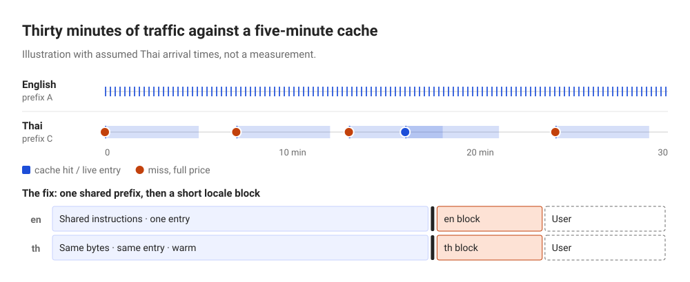

*Figure 7. Illustration with assumed Thai arrival times, not a measurement. Reads refresh the lifetime, so English stays warm while four of five Thai requests pay full price. The locale with the least traffic, already paying a higher premium, also pays the uncached rate most often. Black bar: cache breakpoint. Cache rules from [15] and [11].*

Identical-looking prefixes also need identical bytes. The Hindi loanword for refund, रिफ़ंड, contains फ़, which Unicode can store as one code point (U+095E) or as फ plus a combining dot. Here is the trap an expert would repeat: normalizing to NFC, the usual “canonical composed” form, does not compose this letter. It is a composition exclusion, so NFC *decomposes* it. [16] The two spellings tokenize differently too: 3 and 4 tokens on Gemma 4, 5 and 4 on Llama 4. [1] Pick one normalization form, apply it to every string before assembly, and include it in whatever computes the cache key.

```python
# assemble a cache-friendly prompt
from unicodedata import normalize

def build(locale, user_text):
    nfc = lambda s: normalize("NFC", s)   # U+095E becomes 2 code points
    return [
        {"type": "text", "text": nfc(SHARED),  # same bytes, all locales
         "cache_control": {"type": "ephemeral"}},
        {"type": "text", "text": nfc(LOCALE_BLOCK[locale])},  # after the breakpoint
        {"type": "text", "text": nfc(user_text)},
    ]
```

## More tokens, less understanding?

This is where the story usually overreaches. Table 4 lines up the evidence.

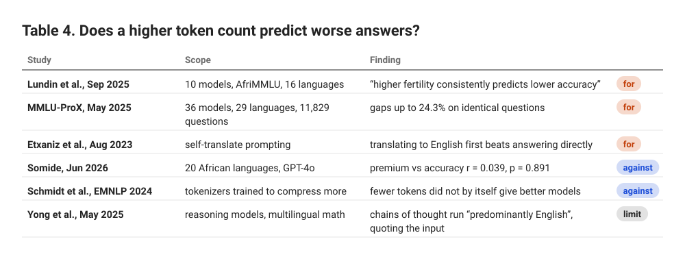

*Table 4. Three findings for the link, two against, one that changes what is billed. Sources, in row order: [17], [18], [19], [8], [20], [21].*

The reading offered here is that both camps measure symptoms of one cause. A language fragments because little of it was in the tokenizer’s corpus, and the model trained alongside usually saw little of it too. Token count and accuracy travel together because they share a parent. Fix the vocabulary and the bill, the window and the clock improve; the model has not thereby learned Amharic. The last row adds a twist for reasoning models: if the hidden chain of thought runs in English, the reasoning tokens billed as output are English-priced, and the premium falls on the quoted input and the visible answer. That is an inference from the paper, not a measurement.

> Token count is a thermometer, not the fever.

Benchmarks also miss what a native reader notices. In Hindi the polite pronoun आप is always grammatically plural, even for one person, so its verb agrees in the plural; [22] a reply that drifts into singular agreement is a fluency error no multiple-choice test catches. Vocabulary is a register decision as well: the loanword रिफ़ंड and the formal प्रतिदाय both mean refund, and on o200k_base the formal word is cheaper, 3 tokens against 4. [1] Token count must never choose the term. Score accuracy errors (wrong facts) apart from fluency errors (right facts, wrong voice); they have opposite fixes, and one averaged score hides which kind a locale has.

## Who sets the rate

A tokenizer is fitted once, frozen, and then rented to every speaker on Earth at a per-token price. Whoever assembled its corpus decided, mostly without meaning to, which languages would be cheap for the life of the model. Ahia and colleagues put the consequence plainly in 2023: speakers of many languages “are overcharged while obtaining poorer results”, and they “tend to also come from regions where the APIs are less affordable to begin with”. [10] The vendors have since cut the gap for large languages; Table 2 shows they have not cut it for everyone, and Qwen3.5’s Amharic shows a new vocabulary can quietly raise it.

The engineering responsibility is narrower and more concrete than fairness in the abstract. Per-token pricing defines a unit the customer cannot audit for most closed models; a team that bills its own users in tokens, or caps a free tier at a token quota, passes the same tax down a level, so a Hindi user gets fewer answers than an English user for the same plan. Quotas in messages or characters, per-locale budgets and published premiums are all available choices. Byte-level research such as MYTE reports shorter and more even encodings across 99 languages, but nothing of that kind is a drop-in fix for a model rented through an API. [23]

## What the refund message showed

- **23–85**: Hindi tokens for the 17-token English reply, across six vocabularies
- **834**: Amharic sentences per 128k window on o200k_base, against 4,820 English
- **3×**: how far characters ÷ 4 undercounts Japanese
- **r = 0.039**: premium vs accuracy in 20 African languages

The refund message that opened this post costs 17 tokens in English everywhere and anywhere from 23 to 85 in Hindi, depending on whose corpus built the vocabulary. That premium is paid four times, on the bill, in the window, on the clock and at the output cap; it is underestimated by English rules of thumb and compounded by caches that go cold in quiet locales. It does not, on current evidence, explain the quality gap by itself: the gap comes from the same thin training data that made the vocabulary expensive, and closing it is a translation-quality problem measured by native reviewers.

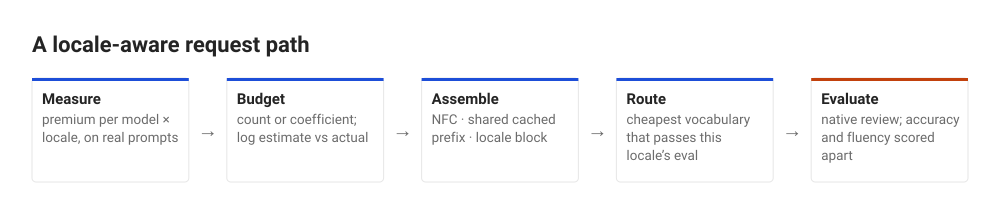

*Figure 8. Where each finding lands in a request path. Illustration. Routing pays most where vocabularies disagree most: Hindi ranges from 1.31× to 2.80× and Amharic from 1.94× to 5.97× across Table 2. Source: [1].*

So the change for Monday is three lines of work, not a research project. Count a hundred real prompts and their production translations on the tokenizer actually being called, and store the ratio per model and locale; re-run it on every model upgrade, because the vocabulary can change under an unchanged price. Move the long instructions into one normalized, byte-identical prefix and put the locale block after the cache breakpoint. And send a native reviewer a sample from the locale with the highest premium, asking two separate questions: is it right, and does it sound like the product. The token tax is set by a corpus somebody else chose. It is still a number a team can own.

## Sources

1. **Measurements for this article.** FLORES-200 devtest and the running example, counted with tiktoken 0.14.0 (cl100k_base, o200k_base) and Hugging Face tokenizers 0.23.1 on the published tokenizer.json of Qwen3-8B, Qwen3.5-9B, Gemma 3 4B, Gemma 4 E4B, DeepSeek-V3.1 and Llama 4 Scout. Oct 5, 2026. Commands in the research log: https://github.com/xkazm04/ai-registry/blob/main/publications/the-token-tax/SOURCES.md#experiments
2. **RFC 3629: UTF-8, a transformation format of ISO 10646 (F. Yergeau).** IETF / RFC Editor. Nov 2003. https://www.rfc-editor.org/rfc/rfc3629
3. **tiktoken README and model-to-encoding map.** OpenAI, GitHub. Read Oct 5, 2026 (v0.14.0). https://github.com/openai/tiktoken
4. **Gemma 3 Technical Report.** Gemma Team, Google DeepMind, arXiv:2503.19786. Mar 25, 2025. https://arxiv.org/abs/2503.19786
5. **Qwen Technical Report (Bai et al.).** Alibaba Qwen team, arXiv:2309.16609. Sep 28, 2023. https://arxiv.org/abs/2309.16609
6. **IndicSuperTokenizer: An Optimized Tokenizer for Indic Multilingual LLMs.** arXiv:2511.03237. Nov 2025. https://arxiv.org/abs/2511.03237
7. **FLORES-200 evaluation benchmark (NLLB release).** Meta AI. Dataset release, downloaded Oct 5, 2026. https://dl.fbaipublicfiles.com/nllb/flores200_dataset.tar.gz
8. **The African Language Tax (Somide).** arXiv:2606.24460. Jun 23, 2026. https://arxiv.org/abs/2606.24460
9. **Language Model Tokenizers Introduce Unfairness Between Languages (Petrov, La Malfa, Torr, Bibi).** NeurIPS 2023, arXiv:2305.15425. May 2023, rev. Oct 2023. https://arxiv.org/abs/2305.15425
10. **Do All Languages Cost the Same? Tokenization in the Era of Commercial Language Models (Ahia et al.).** arXiv:2305.13707. May 23, 2023. https://arxiv.org/abs/2305.13707
11. **Pricing.** Anthropic, Claude Platform docs. Read Oct 5, 2026. https://platform.claude.com/docs/en/about-claude/pricing
12. **Introducing Claude Opus 4.7.** Anthropic. Apr 16, 2026. https://www.anthropic.com/news/claude-opus-4-7
13. **API pricing.** OpenAI developer docs. Read Oct 5, 2026. https://developers.openai.com/api/docs/pricing
14. **Understand and count tokens.** Google, Gemini API docs. Updated Sep 23, 2026. https://ai.google.dev/gemini-api/docs/tokens
15. **Prompt caching.** Anthropic, Claude Platform docs. Read Oct 5, 2026. https://platform.claude.com/docs/en/docs/build-with-claude/prompt-caching
16. **UAX #15: Unicode Normalization Forms, revision 58.** Unicode Consortium (Unicode 18.0.0). Aug 12, 2026. https://www.unicode.org/reports/tr15/
17. **The Token Tax: Systematic Bias in Multilingual Tokenization (Lundin et al.).** AfricaNLP 2026, arXiv:2509.05486. Sep 5, 2025. https://arxiv.org/abs/2509.05486
18. **MMLU-ProX: A Multilingual Benchmark for Advanced LLM Evaluation (Xuan et al.).** arXiv:2503.10497. Mar 13, 2025, rev. May 26, 2025. https://arxiv.org/abs/2503.10497
19. **Do Multilingual Language Models Think Better in English? (Etxaniz et al.).** arXiv:2308.01223. Aug 2, 2023. https://arxiv.org/abs/2308.01223
20. **Tokenization Is More Than Compression (Schmidt et al.).** EMNLP 2024, arXiv:2402.18376. Feb 2024, rev. Oct 2024. https://arxiv.org/abs/2402.18376
21. **Crosslingual Reasoning through Test-Time Scaling (Yong et al.).** arXiv:2505.05408. May 8, 2025. https://arxiv.org/abs/2505.05408
22. **2.1 Personal Pronouns.** Taj Hindi, University of North Carolina. Undated course page, read Oct 5, 2026. https://tajhindi.unc.edu/2-1-personal-pronouns/
23. **MYTE: Morphology-Driven Byte Encoding for Better and Fairer Multilingual Language Modeling (Limisiewicz et al.).** ACL 2024, arXiv:2403.10691. Mar 15, 2024. https://arxiv.org/abs/2403.10691

Prices and model facts change; each entry carries the date of the page or the date it was read.
